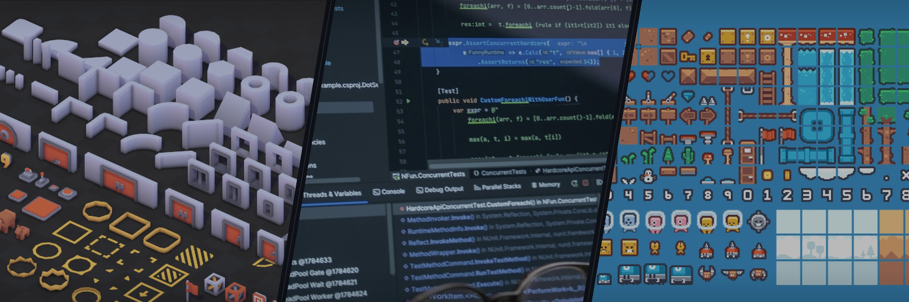
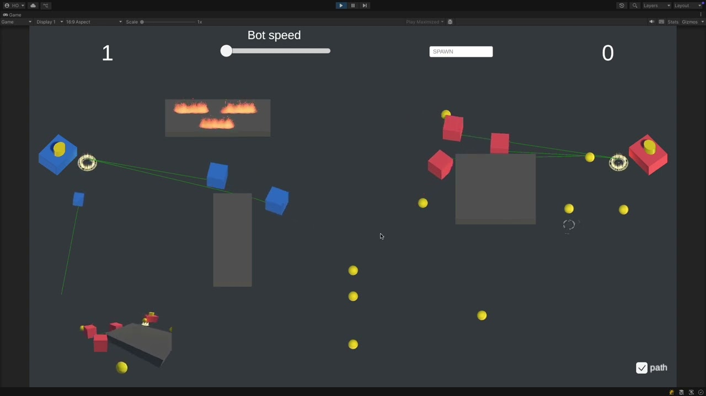

  

# Stanislav

### Senior Unity Developer · I build systems, not script piles.

**Unity / C# · 2D & 3D · Gameplay Architecture · AI · ECS · WebGL**

I work where gameplay meets engineering: game states, physics, autonomous agents, runtime services, monetization, analytics, and platform integrations.

I like code that survives the second feature — not just the first demo. If a project needs both a playable loop and an architecture that will not fight the team later, that is my territory.

[**Telegram →**](https://t.me/stanislavnur)

  
  &nbsp;
  
  &nbsp;
  
  &nbsp;
  
  &nbsp;
  

## Selected builds

### 01 — [Bot Collectors](https://github.com/StanislavNO/bot-collectors)

**A 3D gameplay-systems lab for autonomous collector agents.**

- Per-agent FSM: search → move → collect → return.
- AI Navigation, factories, pooling, DI, configurable factions, and runtime controls.
- Visible agent paths make the decision flow easy to inspect while the simulation is running.

[**Watch the demo →**](https://youtu.be/lXjnF72bpWo) · [**Explore the code →**](https://github.com/StanislavNO/bot-collectors)

---

### 02 — [Asteroids](https://github.com/StanislavNO/Asteroids_Kefir)

**A small arcade game with production-shaped internals.**

- Core gameplay and platform-facing Meta services live in separate layers.
- UniTask, DI, factories, pooling, scene switching, pause handling, and configurable enemies and weapons.
- Unity Ads, IAP, Firebase Analytics, Remote Config, and local session persistence sit behind dedicated boundaries.

[**Explore the code →**](https://github.com/StanislavNO/Asteroids_Kefir)

---

### 03 — [ECS Survival 2D](https://github.com/StanislavNO/ECS_Survival_2D)

**The architecture-deep one: Entitas-style ECS with custom code generation.**

- Separate Game, Input, and Meta contexts.
- Custom generators for entity APIs and single-value components.
- Physics, time, randomness, static data, assets, identifiers, and scene loading are isolated behind small interfaces.

[**Explore the code →**](https://github.com/StanislavNO/ECS_Survival_2D)

## The way I think about Unity

- **Gameplay first.** Architecture earns its place by making iteration safer and faster.
- **Explicit composition beats scene magic.** Dependencies should be visible at the entry point.
- **SDK boundaries matter.** Ads, analytics, purchasing, and platform APIs should not shape gameplay code.
- **2D and 3D are different toolboxes, not different engineering standards.**

## More code worth opening

[WebGameYG](https://github.com/StanislavNO/WebGameYG) — character and enemy FSMs, an event-return pool, scene and pause abstractions, and a Unity WebGL setup with browser-platform packages.

## Let’s talk

If you are hiring for a senior Unity role — or deciding whether I would fit your technical culture — open one of the repositories above and challenge the trade-offs. That is the conversation I want.

[**Message me on Telegram →**](https://t.me/stanislavnur)
